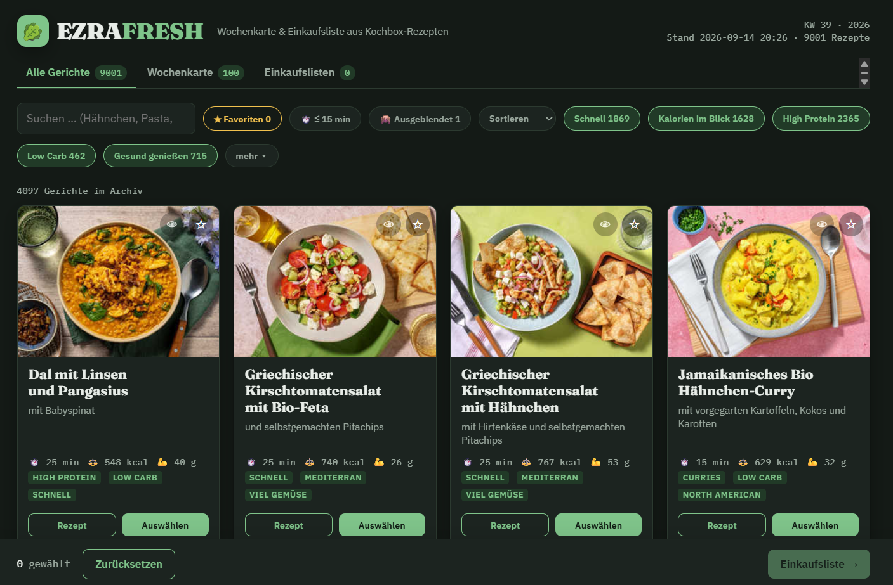

  

  
  
  

<h3 align="center">
  <a href="https://github.com/cinniezra/ezrafresh/archive/refs/heads/main.zip">⬇️ &nbsp;Download</a> ≈ 127 MB
</h3>

 

## Was ist das?

  (\__/) 
  (•ㅅ•) &nbsp;<i>was gibt's heute?</i> 
  / &nbsp;&nbsp;づ🥬

Kochen ohne die Box — alle Rezepte und Wochenkarte eines bekannten Kochbox-Anbieters, mit
verfeinerter Suche, Sortier- und Einkaufslistenfunktion. Rund 9000 Gerichte mit Bild, Zutaten, Zubereitung, Kalorien und Eiweiß, alles in einer einzigen
HTML-Datei, die im Browser läuft. Nichts installieren, kein Login, kein Internet nötig.

  

  🥬 Gerichte aussuchen &nbsp;→&nbsp; 🧾 Einkaufsliste für 2 &nbsp;→&nbsp; 🛒 abhaken · kopieren · fertig

## Öffnen

1. [⬇️ ZIP herunterladen](https://github.com/cinniezra/ezrafresh/archive/refs/heads/main.zip), entpacken.
2. Doppelklick auf **`EZRAFRESH.html`** — Chrome, Edge, Firefox, egal.
3. Fertig. Der Ordner `_ezrafresh` muss neben der HTML-Datei bleiben, da liegen Daten und Bilder.

## Wie es funktioniert

| Oben | Was es tut |
|---|---|
| **Alle Gerichte** | das ganze Archiv, ~9000 Rezepte |
| **Wochenkarte** | was die Kochbox gerade anbietet |
| **Einkaufslisten** | deine gespeicherten Listen |

- **Bild anklicken** = Gericht auswählen · **Rezept** = Zutaten + Zubereitung
- **Suche**, **★ Favoriten**, **⏱️ ≤ 15 min**, Tags (*mehr ▾* zeigt alle)
- **Sortieren** nach Name, Kalorien, Eiweiß oder Zeit
- **👁** neben dem Stern blendet ein Gericht aus, **🙈 Ausgeblendet** holt es zurück
- **Einkaufsliste →** rechnet die Zutaten für 2 Personen zusammen
- In der Liste: **abhaken**, Zutat **anklicken zum Umschreiben** (Ziegenkäse → Feta), **Liste kopieren** für WhatsApp & Co.
- **Vorrat**: was immer da ist (Salz, Öl …) landet gar nicht erst auf der Liste
- **✕** neben einer Liste löscht sie

Favoriten, Listen, Vorrat und ausgeblendete Gerichte werden im Browser gespeichert — nur auf diesem Gerät.

## Kleingedrucktes

Die Rezepte stammen aus einer offenen Datenbank. Einige davon sind sich sehr ähnlich und
unterscheiden sich nur in Kalorien oder Eiweiß — zum Beispiel, wenn der Anbieter die Zutaten
minimal geändert hat. Einfach ausblenden (👁).

Rezepte und Bilder gehören dem Anbieter. Das hier ist ein privates Werkzeug für Freunde,
nicht zum Weiterverteilen.

## Credits

💻 [github.com/cinniezra](https://github.com/cinniezra)
✉️ `cinninini` (Discord)
